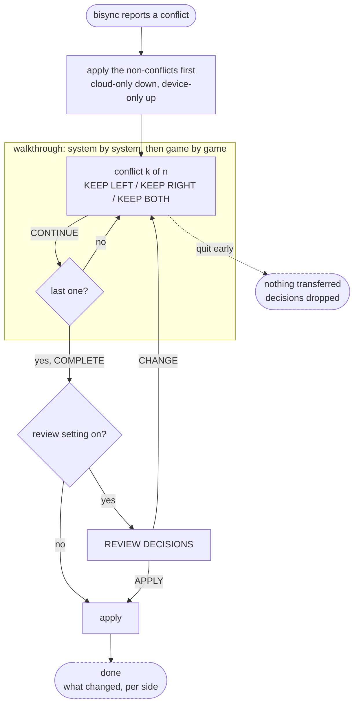

# Conflict wizard — IA and flow

Low-fidelity structure for the cloud-save conflict wizard (#23). **Information
architecture and interaction only** — what is on screen, what the player can do,
and where each choice leads. No visual design: no sizes, colours, spacing or
component choices. Those come later, against
[es-ui-style-guide.md](../.claude/rules/es-ui-style-guide.md).

Companion to [es-menu-map.md](es-menu-map.md), which places this subtree in the
wider menu. Rendered low-fidelity wireframes of these screens, with the reasoning
in the margins: <https://claude.ai/code/artifact/5da9ce12-b088-4db0-8557-4b34fe454dd6>

For reviewed screenshots and baseline status, start at the menu map's
[visual evidence index](es-menu-map.md#visual-evidence-and-flow-coverage)
(D-WORKFLOW-155). These wireframes are historical design material, not current
firmware screenshots. The #508/#510 cloud setup change does not change this
conflict flow; its new branch evidence belongs to the linked setup flow.

> **Rev 6 (2026-09-12).** Four maintainer decisions after the save-history council
> run (#134): one console at a time -- sync never runs on two consoles at once, and
> the wizard assumes the two versions were made in serial by one player
> (D-CLOUD-102, D-CLOUD-103; no lock, no marker). The compare page keeps its columns
> (cloud left, this console right), gains a *played later / earlier on <console>*
> line under each by publish sequence, and opens with the cursor on the newer
> version; the choice stays the player's (D-CLOUD-104). Discarded copies live in the
> one hidden store `Saves/.history/` with every other earlier version, labelled by
> reason (D-CLOUD-095), not in a `-discarded/` sibling.

> **Rev 5 (2026-09-06).** Five maintainer decisions from the conflict-resolution
> council, and one vocabulary. *Keep copies of discarded saves* is **on** by
> default with a count of 1 to 9, default 3 (D-CLOUD-032); the discarded copy
> lives **in the cloud**, beside the saves folder, so any device can restore it
> (D-CLOUD-036); no undo control ships in the wizard — restoring is a separate
> tool reached from the same menu entry (D-CLOUD-033, D-CLOUD-035); a sync
> never opens the wizard over a player, it counts and badges, and one entry,
> MANAGE GAME SAVE RESTORES AND CONFLICTS, owns the queue and the restores
> (D-CLOUD-035) -- **superseded in part by D-UI-043 (2026-09-12): the row
> under SAVE MANAGEMENT is EARLIER VERSIONS OF SAVES and carries no restore
> verb, because restoring an earlier version belongs to #25 after the wizard,
> and a corrupted or legacy entry is trash not yet emptied rather than
> something to offer**; an unexplained absence is asked as a two-button question in
> this same wizard rather than held as a state (D-CLOUD-037). Vocabulary per
> D-UI-022: *discard* now means only the copy chosen against — quitting the
> wizard **drops** its decisions, it does not discard anything.
>
> **Rev 4.** Merged states use ES's own `getNextFreeSlot()`; no slot cap;
> resolutions are recorded in an **audit log**; the wizard is triggered by a
> sync that reports conflicts.
>
> **Rev 3.** Decisions settled, several against ES's actual savestate code.
> No file size shown; interrupted runs discard their decisions; cloud is
> always the left column; *keep discarded saves* is off by default with a
> retention count. Merged states go to the **next free** slot, matching
> `SaveStateRepository::getNextFreeSlot()`, which appends rather than filling
> gaps — superseded by rev 4, see below.

## Scope: what counts as a conflict

Only a genuine fork needs a decision. Everything else is applied without asking:

| Situation | Handling |
|---|---|
| Exists in cloud only | download, no prompt |
| Exists on device only | upload, no prompt |
| Same on both sides | nothing |
| **Changed on both sides since they last agreed** | **conflict — ask** |

The header counts *genuine conflicts*, not files that differ, or it will look
alarming when nothing is at risk.

## Flow



Properties the flow has to keep:

- **Nothing transfers until COMPLETE.** The walkthrough is reversible right up
  to the end; quitting partway leaves both sides exactly as they were.
- **Non-conflicting files are applied before the walkthrough starts.** This is
  not just tidiness: it is what makes the slot choice safe. Once every
  cloud-only file has been downloaded, free-on-device and free-on-both are the
  same thing, and a merge cannot pick a slot the cloud is already using.
- **Every conflict gets a decision.** There is no defer, because a discarded
  copy is recoverable when *keep copies of discarded saves* is on — that setting, not
  deferral, is the escape hatch for "I am not sure".

## Screens

Abstracted. Boxes are regions, not components. Same layout for every conflict —
only the picture and the available options change.

```
┌──────────────────────────────────────────────┐
│ 3 CONFLICTS FOUND                            │   count, not a separate screen
│ <game name> · <system> · <kind>              │
├───────────────────────┬──────────────────────┤
│ CLOUD                 │ THIS DEVICE          │   fixed order, every time
│ ┌───────────────────┐ │ ┌──────────────────┐ │
│ │[☁]   screenshot   │ │ │[🎮]  screenshot  │ │   source badge overlaid
│ │      or glyph     │ │ │      or glyph    │ │
│ └───────────────────┘ │ └──────────────────┘ │
│ <date> <time>         │ <date> <time>        │
│ <device + model>      │ <device + model>     │
│ <emulator/core + ver> │ <emulator/core + ver>│
│ played later here     │ played earlier here  │   by publish sequence, D-CLOUD-104
├───────────────────────┴──────────────────────┤
│  ( KEEP LEFT )  ( KEEP RIGHT )  ( KEEP BOTH )│   selected side(s) highlight
│  [ CONTINUE ]        …or [ COMPLETE ] if last│
│  merged saves move to the next free slot     │   only when KEEP BOTH is picked
└──────────────────────────────────────────────┘
```

Selecting a side **highlights that column**, so LEFT/RIGHT never has to be
mapped mentally onto CLOUD/DEVICE. Keep the sides in a **fixed order** across
every conflict — muscle memory does the work on a long list, and a column that
swaps sides is how the wrong save gets picked at speed.

The page opens with the cursor on the KEEP under the **newer** version, ordered by
publish sequence, never by clock (D-CLOUD-104): the two versions were made in
serial by one player (D-CLOUD-103), so the later session is the common answer
to a missed sync and is one press away. Nothing is kept without that press, and
the other version is retained in `Saves/.history/` either way.

**Retention is unconditional, and the table below said otherwise until the
#147 sweep.** Nothing leaves the cloud's current save unless that version is
already in the store (`save-history-consensus-amendment.md`, retain-only), and
even with the history setting OFF the retain step still runs before a version
is displaced -- OFF stops long-term history, not the transaction copy
(D-CLOUD-105). The *keep copies of discarded saves* toggle therefore governs
how long a losing copy is kept and whether it is offered, never whether it is
taken. The escape hatch from a wrong press is the store, not the setting.

## What each kind shows

| | Save state | Game save |
|---|---|---|
| Picture | screenshot, source badge overlaid | glyph, source badge overlaid |
| Metadata | date · time · device + model · **core + version** | date · time · device + model · emulator + version |
| Not shown | file size — not actionable when choosing between two saves | same |
| Emulator info means | **compatibility** — core- and chipset-specific, may not load (#19) | context — usually portable across emulators |
| KEEP BOTH | yes — moves to the next free slot via ES's `getNextFreeSlot()` | **no** — fixed slots; shown disabled with a reason |
| Losing copy | **always retained** in `Saves/.history/` | same |

KEEP BOTH is **dimmed, not hidden**, on in-game saves — the house rule from
[es-ui-style-guide.md](../.claude/rules/es-ui-style-guide.md), and a dimmed control with a reason
teaches what a vanished one cannot.

## Settings

Two toggles, both in the cloud-saves area:

- **Review decisions before applying** — off by default; turns the summary from
  a step everyone pays for into one the careful can opt into.
- **Keep copies of discarded saves** — on by default (D-CLOUD-032); retains the losing copy so a
  choice can be undone. A **count selector** sets how many to keep, and stays
  visible but unselectable while the toggle is off (dim, don't hide — the
  capability should be discoverable before it is enabled). The fixed count is
  also the retention rule, so discarded copies cannot grow without bound on
  card storage. Same machinery as #25 (pre-change snapshots and rollback);
  build it once.

## Semantics

The icon says *where*, the badge says *what is happening to it*:

| Meaning | Glyph |
|---|---|
| cloud side | cloud |
| this device | gamepad |
| in-game save | floppy |
| savestate | picture |
| will download / upload | cloud-download / cloud-upload (pre-composed) |
| may not load here | warning (#19) |
| resolved / discarded | check-circle / times-circle |

All present in the shipped `fontawesome-webfont.ttf` — see #23 for codepoints
and why pre-composed glyphs beat overlaying two text glyphs. The source badge
over a screenshot *is* a real overlay, but it is a badge over an image, which is
ordinary.

**Conflict is a property of the pair, not of a side.** The header owns "this is
a conflict"; the panels own "here is what each one is".

## Settled

- **No file size** on either panel — not actionable for choosing between saves.
- **Progress does not survive an interruption.** Quitting drops decisions and
  applies nothing. Redoing a few choices beats risking a half-applied
  resolution, and it keeps the "nothing transfers until COMPLETE" guarantee
  simple.
- **Cloud is always the left column.** And the columns never swap to put the newer
  version on one side; the *played later / earlier* line says which is which, and
  the cursor opens on the newer (D-CLOUD-104).
- **Serial play is assumed.** One person, one console at a time; no lock or marker
  tells another console a game is in play; the missed sync is the wizard's case
  (D-CLOUD-102, D-CLOUD-103).
- **Keep copies of discarded saves is on by default** (D-CLOUD-032, D-CLOUD-036), with a count selector, default 3, 1 to 9 -- the copies in `Saves/.history/` with the other earlier versions (D-CLOUD-095); the count's range and its fleet-wide meaning are P-1/P-2 on #134.

## What ES already does (checked, not assumed)

- `SaveStateRepository::getNextFreeSlot()` returns **highest occupied + 1**, and
  scans to 99999 — so slot exhaustion is not a real constraint and there is no
  99-slot ceiling to design around. **Use it for merges.** Because ES compacts
  slots after every deletion (below), slots are normally contiguous, and
  "highest + 1" *is* the lowest unused slot. Reusing it also inherits
  `firstslot` handling and any future change to slot conventions.
- `GuiSaveState` calls `renumberSlots()` after **every** savestate deletion, so
  gaps do not persist in normal local use. The only way to get one is sync
  bringing down a higher-numbered state from another device; appending past it
  is still safe, and avoids placing a merged save where ES may renumber later.
- `SaveState::copyToSlot(slot, move)` **already renames the `.png` alongside the
  state**, so a merged savestate keeps its screenshot for free. Reuse it.
- `SaveStateRepository::renumberSlots()` compacts slots to be contiguous, if
  reclaiming gaps is ever wanted.
- Slot filenames are `{{romfilename}}.state{{slot}}` with the thumbnail at
  `{{romfilename}}.state{{slot}}.png`, from `firstslot = 0`.

## Detection, and what triggers the wizard

A sync that reports conflicts opens the wizard. The mechanism is
**`rclone bisync`** (#9), whose defaults suit this well:

- `--conflict-resolve none` — the default — **detects and reports rather than
  picking a winner**, which is exactly the project's rule that conflict
  handling must never default to recency.
- `--conflict-loser num` renames the loser rather than deleting it.

Two consequences worth planning around:

- Much of the detection engine (#22) may be *reading what bisync already found*
  rather than diffing manifests ourselves. Manifests are still needed to
  **display** a conflict — device name, emulator, core — but perhaps not to
  find one.
- **Do not let bisync do the renaming for savestates.** Its loser suffix
  (`…conflict1`) breaks the `{{romfilename}}.state{{slot}}` pattern ES matches
  on, so the file would vanish from the savestate manager. Detect with bisync,
  then resolve into slots ourselves.

## Where state lives

| What | Where | Why |
|---|---|---|
| Per-save sidecar manifest | beside the save, **synced** | the truth; small, text, independently resolvable |
| History / audit database | `/storage/.cache/cloud_sync/history.db`, **never synced** | a local index, rebuildable from the sidecars |

`/storage/.cache/` is the established home for state that persists but can be
regenerated — it already holds `ld.so.cache`, `fontconfig`, `cores`,
`kernel-overlays`. Three properties make it right here:

- **Outside the sync scope.** Syncing runs from `/storage/roms`, so a database
  here cannot become a sync conflict — and a database is the one file a player
  has no way to resolve by hand. Verified the hazard is real: a `.db` placed
  under `savestates/` *does* sync today, `-wal` sidecar and all, because
  `+ /savestates/**` takes the whole directory.
- **Outside backups.** `backuptool` archives `/storage/.config/*`, so nothing
  in `.cache` bloats a backup or carries a binary blob into the cloud archive.
- **Survives updates.** `.cache` is not wiped on update; individual caches
  self-invalidate instead — `userconfig-setup` rebuilds `ld.so.cache` when
  `/etc/os-release`'s stamp changes. Follow that convention: store a schema
  version and rebuild when it does not match, rather than assuming the file is
  always current.

**One database, not one per system.** The audit log spans systems, the volume is
trivial for SQLite, and a single file means one migration path and one thing to
rebuild.

**Hashes are the identity.** Store our own (sha256, at capture) in the sidecar
and compare sidecar to sidecar — the remote's native hash type varies by
backend (S3 md5, Dropbox its own), so it is useful only as a cheap
"did this change" shortcut via `rclone lsjson --hash`, which reads it from
remote metadata without downloading. A hash identifies a *version*; the history
is what links versions over time.

## Audit log

Every resolution is recorded: what conflicted, which side won, where a merged
copy went, and when. This replaces per-save origin tracking — after a merge the
copy is simply a savestate in a slot, and the log is what remembers it came
from the cloud.

Needs deciding: where it lives, how long it is kept, and whether it is
surfaced in the UI or is purely a support artefact.

## Open questions

- ~~Where does the audit log live, what is its retention, and is it visible to
  the player?~~ **Settled 2026-09-04, D-CLOUD-027.** With the other logs, in
  the OS's persistent log directory: `/storage/.cache/log/cloud_audit.log`,
  append-only text, rotated at 1 MiB keeping one predecessor, support-only for
  now (the wizard's summary page is what the player sees). `/var` is tmpfs on a
  shipped device and `/var/log` binds to `/storage/.cache/log` only in debug
  mode, so that directory is the one place that is both "with the other logs"
  and still there after the reboot that follows a wrong choice. Whether the
  SQLite index above is still needed beside a text log is #20's call; the
  stamps already live under `/storage/.cache/cloud_sync/` (underscore), and the
  table above now uses the same directory.
- **Slot numbers are not stable identities across devices.** ES renames files
  when it renumbers after a deletion, which sync sees as delete + create, so
  the same state can arrive on another device under a different slot number.
  Conflict pairing, the manifest and the audit log all need to key on something
  other than the slot. Tracked on #24.
