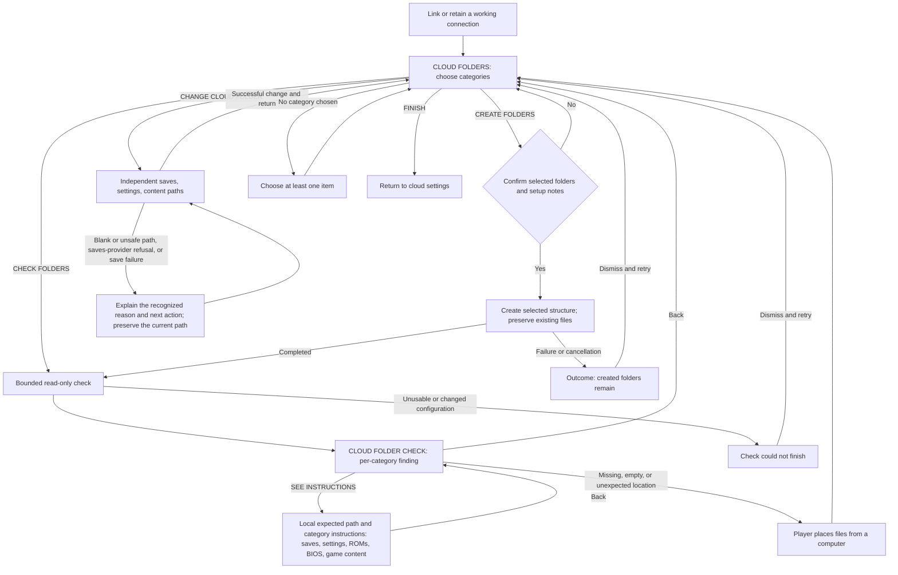
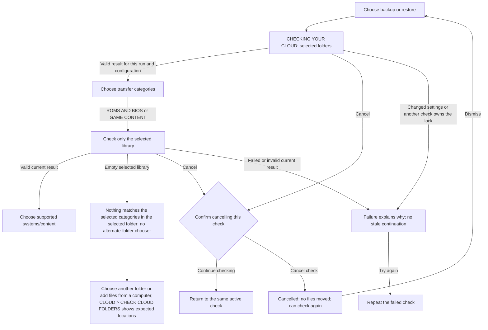
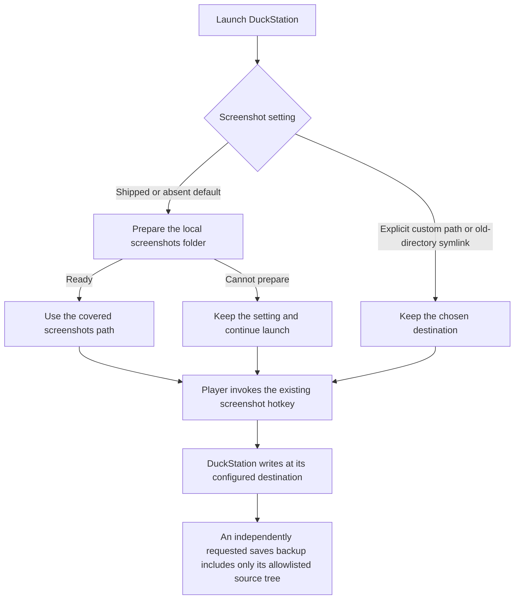
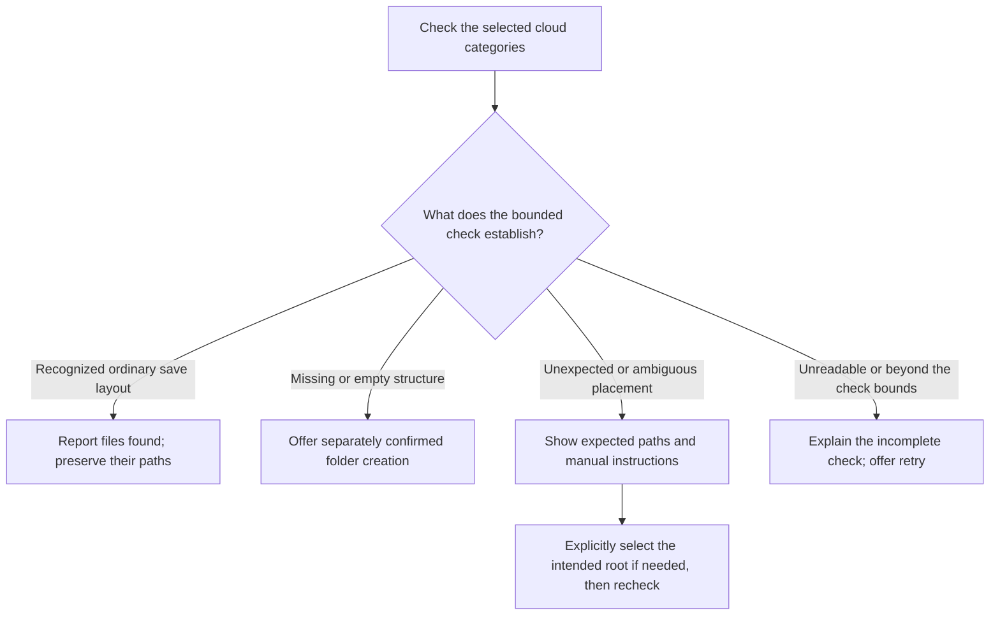
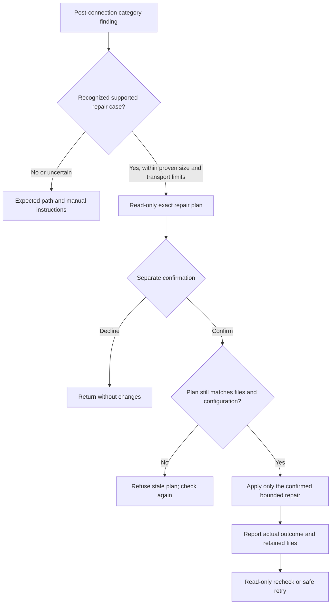

# Cloud folder flow review

Status: post-rclone setup contract reaffirmed, 2026-10-08 (D-CLOUD-178/179).
#510 owns this contract. Distribution `6f89bc7cec` and ES `4e410dc9a8`
implement category checks, explicit creation, independent paths and local
instructions. Full host regression and both ordinary VM backends pass. The
completed UI inventory includes the #512 localized failure/check-busy fix,
#513 small-panel help/editor fit, and #514 selected-folder empty guidance.
Coordinated product integration `e6645cb5ea` and its proof are published on
next `bc4ae05d30`; ES `4e410dc9a8` is published and pinned. #515's finite case
review and fixes #520/#521/#522/#523 are qualified and closed. Valid layouts
stay in place; ambiguous locations keep instructions. #507's independent
frozen delta audit is next, followed by assembled firmware, clean/public
adoption and device qualification. #511 owns the parallel website; guide
publication does not hold useful local instructions or add a firmware gate.

## Who is upgrading

The maintainer confirms that nobody else used the fork or the changes in the
unmerged ROCKNIX PRs. Product adoption is from publicly released ROCKNIX, plus
a clean install. The maintainer's experimental `/ROCKNIX` to `/pixelelated`
cloud move is a separate owner-managed task, not a compatibility requirement for
the product. Existing experimental-state receipts remain historical evidence.

The official latest release checked on 2026-10-07 is
[ROCKNIX 20261001](https://github.com/ROCKNIX/distribution/releases/tag/20261001),
tag commit `c445081a59518f37d9776e5412dd7b14910696f7`.
Its [cloud configuration](https://github.com/ROCKNIX/distribution/blob/20261001/projects/ROCKNIX/packages/network/rclone/sources/cloud_sync.conf)
uses `SYNCPATH=/GAMES` and `SYNCPATH_BACKUP=/GAMES/backup`. The default
[allowlist](https://github.com/ROCKNIX/distribution/blob/20261001/projects/ROCKNIX/packages/network/rclone/sources/cloud_sync-rules.txt)
includes progress, screenshots and backup archives, and excludes ordinary
ROM/BIOS content. This release does not install the fork's cloud setup, content
transfer or layout-migration helpers. Custom user configurations still exist.

This is an adoption baseline, not a request to merge newer upstream product
code across the existing source freeze. Retain the ordinary config-key
conversion and safety checks needed by that real predecessor; review inferred
content defaults and unpublished-layout fallbacks against this actual scope.

## What the old tidier actually did

Submitted distribution PR3404 at `4c83ebede40af27a375ced4cac72983be5715944`
and ES PR40 at `ca300dd41e13c168023e9e3d8aa7afb874170455` already exposed
the optional tidier before the hard fork. Neither PR merged.

The engine copied, verified and deleted files, rather than merely changing
folder settings. It processed settings backups, saves and, for derived old
content paths, ROMs/BIOS. A recovery branch also treated a `/Content` suffix
as evidence of an old layout. Its saves move recursively listed that folder
with exclusions for other tiers; it did not apply the ordinary progress
allowlist. Removing the content-tier move alone would therefore not establish
a progress-only operation. On providers without usable hashes, verification
could download source and destination bytes through the handheld.

The manual-setup draft removed that engine and its UI action but retained a
`cloud_backup` warning directing nested-folder users to the removed TIDY
action. Public ROCKNIX's nested backup default could trigger it. Commit
`2cffff3f38` replaces that instruction with the independent folder settings;
final firmware inclusion is still pending.

## Historical draft capabilities and gaps

This table describes the pre-validator drafts `3268015c` and `300f97d2`,
which motivated the changes below. It is not the current implementation.

| Control | What those historical drafts did | Design consequence |
| --- | --- | --- |
| Link cloud storage | Uses configured paths; creates directories and README files. | Linking must remain separate from relocating files. |
| Change Cloud Folder | Changes the saves pointer and derives sibling Backups and Content pointers. No files move. | It can overwrite an independently chosen library location. Its name does not explain that scope. |
| ROM/content chooser | Changes only CONTENT_REMOTE; preserves saves and settings paths. | Useful existing mechanism, but it is not yet a clear standalone library setting. |
| Chooser navigation | Offers a discovered candidate, provider root and root-level children, when restore finds no content at the selected location. | No recursive browser or arbitrary nested-path entry in this UI. The backend setter accepts a validated nested path. |
| Content backup | Writes ROMs under `<content>/ROMs/<system>` and BIOS under `<content>/BIOS`. | Selecting a folder does not currently select an arbitrary library layout. |
| Content restore | Reads the tiered shape, a flat selected-root shape, and certain provider-root fallbacks. | The selected root is not an exclusive boundary; backup/restore can use different shapes. |
| System selection | Selects system names for deliberate content transfers. | It does not define per-system remote paths or require the whole cloud library locally. |

Source: `cloud_setup` setters and `--content-location`,
`cloud_content_backup::remote_for`, `cloud_content_restore::resolve_src`,
`cloud_sync_helper` config conversion, and ES `cloudOfferContentFolder`,
`cloudOpenContentFolderChooser` and `cloudSetupOpenSyncPathEditor` in the
local #508 worktrees. The source proof and actual UI receipts are retained
under `docs/qa-logs/2026-10-07-manual-cloud-setup/`; they describe this draft,
not an approved future flow or an assembled firmware image.

## Agreed direction: check categories, then offer explicit actions

1. Link cloud storage, or retain the working connection and selected paths
   from public ROCKNIX. Linking does not authorize a move or a restore.
2. After connection, show category checks, explicit folder creation and useful
   instructions together. Create the supported structure only after the player
   confirms the selected categories; linking alone creates nothing.
   Fresh defaults remain `/pixelelated/Saves`, `/pixelelated/Backups` and
   `/pixelelated/Content`. ROMs use `<content>/ROMs/<system>` and BIOS uses
   `<content>/BIOS`. Existing pointers remain until deliberately changed;
   changing a progress location must not silently replace a separate library
   choice. A general arbitrary-layout browser is outside this first contract.
3. Let the player place ROMs and BIOS into the expected structure from a
   computer. A device need not have every system or game in the cloud library.
4. Offer read-only checks for enabled categories, using the existing scan and
   category interface where their behavior fits. A completed check reports
   findings; it does not organize, download, overwrite or remove cloud files.
5. For recognized progress-file problems, offer a separate bounded action
   only after its exact plan is shown. ROM and BIOS findings offer instructions
   and expected paths. Normal selective backup/restore remains a separate
   deliberate action.

The implemented diagram and screenshot coverage are below. The prospective
progress-file repair is described under **Small-file fixes**; it is not an
implemented branch or a qualified screen.

## M7 implementation order and ownership

The milestone body is the execution queue; this table maps its M7.P5 work to
contract and evidence. Issue numbers identify work, not its priority.

| Order / issue | Work and present state | Exit evidence |
| --- | --- | --- |
| 1 — [#510](https://github.com/pixelelated/distribution/issues/510) | Reconcile the settled post-connection contract, canonical flows, issues and rules. The validator/create/instructions foundation has completed source-overlay proof. | This reference, D-CLOUD-179 and live issue/milestone readback agree; no pending request to choose the overall approach. |
| 2 — [#515](https://github.com/pixelelated/distribution/issues/515), children [#520](https://github.com/pixelelated/distribution/issues/520) and [#521](https://github.com/pixelelated/distribution/issues/521), with runtime prerequisites #522/#523 | Qualify source-derived layout preservation and the confirmed standalone save-coverage fixes. The finite case review supports instructions for ambiguous placement, with no demonstrated generic relocation. | Source-cited case/disposition table; real-rclone coverage and no-action controls; reviewed affected VM frames. No repair action or repair-screen completion is implied. |
| 3 — [#508](https://github.com/pixelelated/distribution/issues/508) | Integrate the qualified foundation and #515's result, retire the automatic cloud migration and promote coordinated distribution/ES pins. | Exact source/install/call-site sweep and integration manifest; preserved public credentials and independent pointers; canonical diagrams and source-bound proof travel with the changes. |
| 4 — [#507](https://github.com/pixelelated/distribution/issues/507) | Freeze and independently audit the resulting P5 delta. | Required primary/cross-lab review receipts and resolved findings for those frozen inputs; no replay of the completed candidate16 audit. |
| 5 — #508 / #492 / #344 / #265 / #359 | Assemble engineering firmware, prove clean install and public ROCKNIX adoption, then complete source/licence, named physical and release gates. | CF10 installed-image evidence, final input/inclusion mapping and each applicable release artifact. Engineering builds supply this evidence; source-overlay proof alone does not designate an RC. |
| Parallel — [#511](https://github.com/pixelelated/distribution/issues/511) | Publish the setup, ROM and BIOS guides; activate QR destinations only after the pages work. | Published guide/link proof and actual QR/navigation proof when enabled. Useful local instructions do not wait for the website. |

There is no blanket organizer and no owner-specific migration compatibility
branch in this plan. #515 does not silently defer a demonstrated, requested
repair: each case has an explicit disposition, and changes to delivery scope
must be reflected in #510 and M7. No personal-cloud action is needed to
establish the contract or qualify it with synthetic fixtures.

## Implemented flow and visual proof

This is the #508/#510 source draft, not the accepted firmware. Category
switches select the scope of the next check/create action; they do not enable
automatic sync or change its separate settings. Saves/settings start selected;
ROMs, BIOS and game content start unselected. Linking alone moves no files
and creates no folders.

The saves editor also checks the provider before accepting its path. The
settings and content editors check local path syntax; their later category
check establishes whether the chosen cloud folder can be read. A refusal keeps
all selected paths and file contents unchanged. Its dialog translates recognized
reasons into bounded guidance; arbitrary provider output is not player-facing
copy. Unknown errors retain a general path/connection instruction (#524).

The changed backup/restore preview keeps its own read-only check and transfer
choice. It does not discover or adopt another library when the selected one
is empty:

**Coverage record (D-WORKFLOW-155/156).** The completed disposable-VM packet
contains 99 index entries: 89 reviewed frames, nine rejected frames, and CF10
explicitly pending final firmware/public adoption. English and French at
640×480 and 1280×800 are represented; this is the affected-flow inventory,
not every possible locale/panel permutation or a new whole-app baseline.
The [evidence index](../qa-logs/2026-10-07-cloud-validator/ui/evidence-index.json)
binds each state to source, installed hashes, trigger/outcome, locale, panel
and review. The [final root review](../qa-logs/2026-10-07-cloud-validator/ui/root-supplement-review.json)
verifies all 99 entries, 514 pre-retirement file seals and exact source hashes,
and records independent visual review of 16 supplemental frames. The original
[root review](../qa-logs/2026-10-07-cloud-validator/ui/root-review.json) remains
limited to its original 42 entries. The
[completed-state independent review](../qa-logs/2026-10-07-cloud-validator/reference-review03.md)
is likewise bound to its earlier checkpoint; later additions received root
review before teardown.

The [diff-derived inventory](../qa-logs/2026-10-07-cloud-validator/reference-review02.md)
now has a disposition for each affected help/error/callback state. Earlier
frames retain their source and explicit unchanged-input justification;
rejected cancellation, truncated-JSON, clipped or misleading-copy frames
remain rejected. The retained
[index checker](../qa-logs/2026-10-07-cloud-validator/verify-ui-index.py)
validates references, dimensions and digests, not semantic coverage. Source
overlays do not replace the accepted firmware benchmark or close CF10.

The [standalone-save supplement](../qa-logs/2026-10-08-save-repair-cases/ui/evidence-index.json)
adds ten reviewed frames for CF02/CF07/CF14 at distribution `1ee8e5199d`,
with unchanged ES source `4e410dc9a8`. It shows ordinary PSP/DuckStation/N64
saves recognized, deeper/unreadable results and retry, and the selected restore
flow reporting progress-only content as empty. EN640 and representative FR1280
are retained; this does not claim every locale/panel combination was rerun.
The [root review](../qa-logs/2026-10-08-save-repair-cases/root-ui-review.json)
binds file/config preservation and actual scan stamps. A cached-fixture result
remains explicitly rejected. No UI wording changed for this coverage fix.

| Flow/branch | Trigger and expected outcome | Reviewed evidence and remaining gate |
| --- | --- | --- |
| CF01 — connected setup | Enter from the cloud hub or complete a connection; category choices appear without creating or relocating files, including OAuth CONTINUE. | [Connected categories](../qa-logs/2026-10-07-cloud-validator/ui/frames/en640-link-complete/01-folder-scope.png); [hub return](../qa-logs/2026-10-07-cloud-validator/ui/supplemental/frames/walk-fr640-hub-return-01-category-finish-hub.png); [OAuth CONTINUE callback](../qa-logs/2026-10-07-cloud-validator/ui/supplemental/frames/walk-fr640-oauth-callback02-02-oauth-continue-categories.png). Exact no-network helper/setup and restoration receipts retained; this proves the callback, not provider authentication. |
| CF02 — check selected folders | Choose categories; read-only results show only those paths and distinguish files found, missing, empty, unexpected location and unreadable. | 30 host controls; [populated results](../qa-logs/2026-10-07-cloud-validator/ui/frames/fr640-sealed-results/02-populated-findings.png) and [misplaced ROMs](../qa-logs/2026-10-07-cloud-validator/ui/frames/fr640-sealed-help/01-misplaced-roms.png). All category states are indexed. |
| CF03 — create selected folders | Confirm; only chosen folders/notes are created; completion starts a fresh check. Decline changes nothing. | [Confirmation](../qa-logs/2026-10-07-cloud-validator/ui/frames/en640-create-saves/01-create-confirmation.png), [completion](../qa-logs/2026-10-07-cloud-validator/ui/frames/en640-create-saves/02-creation-result.png), and [decline](../qa-logs/2026-10-07-cloud-validator/ui/frames/en640-final-create-decline/02-declined.png). [CloudOffer CREATE IT](../qa-logs/2026-10-07-cloud-validator/ui/supplemental/frames/walk-fr640-offer-create-01-offer-create-done.png) also proves saves-only creation; other pointers/files are preserved. |
| CF04 — manual instructions | Open help from a finding; expected path and category guidance appear; Back returns without changing configuration or files. | [ROM instructions](../qa-logs/2026-10-07-cloud-validator/ui/frames/fr640-sealed-help/02-rom-instructions.png), [BIOS instructions](../qa-logs/2026-10-07-cloud-validator/ui/frames/fr1280-sealed-help/04-bios-instructions.png), [saves help](../qa-logs/2026-10-07-cloud-validator/ui/supplemental/frames/walk-fr640-fit-final-02-saves-help-fixed.png), [settings help](../qa-logs/2026-10-07-cloud-validator/ui/supplemental/frames/walk-en1280-empty514-04-settings-instructions.png), and [game-content help](../qa-logs/2026-10-07-cloud-validator/ui/supplemental/frames/walk-en1280-empty514-05-media-instructions.png). Indexed EN/FR small/large variants reviewed; #513 retains full category names in wrapping prose. QR awaits published guides. |
| CF05 — change a path | Edit one pointer; others survive; return retains category choices. Refusals explain recognized reasons and next actions while preserving paths and files. | [Changed path](../qa-logs/2026-10-07-cloud-validator/ui/frames/en640-path-return/01-changed-settings.png) and [retained choices](../qa-logs/2026-10-07-cloud-validator/ui/frames/en640-path-return/02-returned-selection.png). Current refusal evidence: [PL-003 packet](../qa-logs/2026-10-08-m7-audit-resolutions/PL-003/README.md) and [indexed EN/FR 640×480 and 1280×800 frames](../qa-logs/2026-10-08-m7-audit-resolutions/PL-003/evidence-index.json). Earlier generic refusal frames remain historical audit evidence, superseded for copy quality by ES1d76b3da7. [Fitted editor title](../qa-logs/2026-10-07-cloud-validator/ui/supplemental/frames/walk-fr640-fit-final-03-content-title-fixed.png) remains unchanged. |
| CF06 — stale configuration | Change the config/endpoint between display/check/confirmation and use; reject stale results/actions and require a refreshed view. | Bound-context controls and [stale-action refusal](../qa-logs/2026-10-07-cloud-validator/ui/frames/en640-stale-rejection/01-stale-rejected.png). |
| CF07 — cannot read/retry | Synthetic endpoint refuses or returns partial output; no false empty/success; retry uses the current config. | Failure/partial-output controls and [unreadable result](../qa-logs/2026-10-07-cloud-validator/ui/frames/en640-unreadable-result/01-unreadable-result.png); paused endpoint restored for subsequent successful retry. |
| CF08 — no selection | Turn off every category; Check/Create asks for at least one item without contacting the cloud. | [Create refusal](../qa-logs/2026-10-07-cloud-validator/ui/frames/en640-no-selection/02-create-needs-selection.png) and [check refusal](../qa-logs/2026-10-07-cloud-validator/ui/frames/en640-no-selection/03-check-needs-selection.png); French equivalents indexed. |
| CF09 — creation interrupted | Cancel/fail during creation; outcome explains retained folders and permits retry without moving user files. | [Cancellation](../qa-logs/2026-10-07-cloud-validator/ui/frames/en640-final-cancelled/01-cancelled-outcome.png) and [retry](../qa-logs/2026-10-07-cloud-validator/ui/frames/en640-final-retry/01-retry-result.png) with endpoint still paused/no child/unchanged inventory; [localized creation failure](../qa-logs/2026-10-07-cloud-validator/ui/supplemental/frames/walk-fr640-create-settings-failure-01-create-settings-failure.png) and [fresh check after retry](../qa-logs/2026-10-07-cloud-validator/ui/supplemental/frames/walk-fr640-create-retry-01-create-retry-current-check.png). Original failures remain rejected. |
| CF10 — clean/public adoption | Fresh defaults and public ROCKNIX /GAMES plus /GAMES/backup remain distinct cases; preserve existing pointers/credentials/data. | Three public-config host controls pass. **Pending:** assembled firmware clean/public adoption; source overlays cannot close it. |
| CF11 — nested-folder backup outcome | Back up with a settings/content path inside the saves path; review the actual transfer outcome and trace the script diagnostic separately. | [Small-panel backup result](../qa-logs/2026-10-07-cloud-validator/ui/supplemental/frames/walk-en640-nested-backup-02-backup-nested-outcome.png) and [large-panel result](../qa-logs/2026-10-07-cloud-validator/ui/supplemental/frames/walk-en1280-nested-backup-01-backup-nested-outcome.png). [Consumer trace](../qa-logs/2026-10-07-cloud-validator/ui/supplemental/receipts/nested-warning-completed-trace.json) proves the plain stdout warning is discarded; actual logs show both warnings fired. Payload hashes/nested sentinels verified; no visible warning is invented. |
| CF12 — invalid folder-check response | Valid context but the check cannot supply a usable result; show the generic check-failed dialog, preserve selection, and allow another check. | [English refusal](../qa-logs/2026-10-07-cloud-validator/ui/supplemental/frames/walk-en640-invalid-01-invalid-result.png) and [French refusal](../qa-logs/2026-10-07-cloud-validator/ui/supplemental/frames/walk-fr1280-invalid-result-01-invalid-result.png) from actual execution fault; helper permissions/hash restored. This is distinct from valid unreadable-category findings. |
| CF13 — scan interruption or failure | Cancel a scan, or change its config/encounter its lock; explain the actual outcome without claiming files moved or advancing with stale data. | [Cancel question](../qa-logs/2026-10-07-cloud-validator/ui/supplemental/frames/walk-en640-scan-cancel-01-scan-cancel-question.png), [cancelled outcome](../qa-logs/2026-10-07-cloud-validator/ui/supplemental/frames/walk-en640-scan-cancel-02-scan-cancelled.png), [changed settings](../qa-logs/2026-10-07-cloud-validator/ui/supplemental/frames/fault-settings-changed03-settings-changed-fixed.png), [retry](../qa-logs/2026-10-07-cloud-validator/ui/supplemental/frames/fault-settings-changed03-settings-changed-retry.png) and [busy check](../qa-logs/2026-10-07-cloud-validator/ui/supplemental/frames/walk-en640-scan-busy-01-scan-busy-fixed.png). Actual lock/config/cancellation controls and French frames indexed; no stale continuation or file movement. |
| CF14 — selected-library restore | Continue through scan, categories and supported systems using only the configured content root; an empty root must not discover a populated unselected library. | [Supported-system selector](../qa-logs/2026-10-07-cloud-validator/ui/supplemental/frames/walk-en1280-supported-systems-02-selected-supported-systems.png) and [Back without restore](../qa-logs/2026-10-07-cloud-validator/ui/supplemental/frames/walk-en1280-supported-systems-03-return-without-transfer.png) follow actual general/content scans. [Corrected empty selected folder](../qa-logs/2026-10-07-cloud-validator/ui/supplemental/frames/walk-en640-empty-help514-01-selected-folder-empty-fixed.png) excludes the populated other library. EN/FR small/large empty frames fit; pointers/inventories unchanged. #514 old overbroad message remains rejected. |
| CF15 — restore relink finish | Finish relinking after settings restore; return to the caller without scheduling a folder migration. | [Restore completion page](../qa-logs/2026-10-07-cloud-validator/ui/supplemental/frames/walk-fr640-relink-finish-01-restore-finish-page.png) and [FINISH return](../qa-logs/2026-10-07-cloud-validator/ui/supplemental/frames/walk-fr640-relink-finish-02-restore-finish-return.png). Synthetic marker is consumed, no migration follows; no real settings restore/OAuth is claimed. |

Source controls are retained under
[`2026-10-07-cloud-validator`](../qa-logs/2026-10-07-cloud-validator/).
Menu placement is in [the canonical map](../es-menu-map.md#cloud-our-subtree).
Folder findings establish presence within bounded metadata, not transfer
integrity or BIOS compatibility. Backup/restore remains a separate action.

## DuckStation screenshot coverage

This is the local screenshot writer's relationship to saves backup, not a new
cloud menu or relocation action. #521 directs new screenshots from shipped
or retained default settings to `/storage/roms/screenshots`. Explicit custom
paths and a custom symlink for the historical default remain as chosen.
The shared helper runs from both the game and Tools launchers. It changes
only the default setting after a successful bounded preparation; a refusal
keeps the setting and permits the ordinary launch. It moves no existing capture.

| State | Trigger and expected result | Proof boundary |
| --- | --- | --- |
| DS01 — default capture | The existing screenshot hotkey creates a rendered PNG in the covered screenshots folder; historical captures stay unchanged. | [Native default frame](../qa-logs/2026-10-08-save-repair-cases/duckstation-captures/vm-ui/frames/default-hotkey.png) and actual generated-PNG ordinary saves backup/restore pass in the [capture packet](../qa-logs/2026-10-08-save-repair-cases/duckstation-captures/vm-ui/README.md). Synthetic reset-ROM output is not commercial game/save compatibility. |
| DS02 — custom destination | The same hotkey uses the explicit custom destination; it is not silently redirected or claimed backed up outside the configured saves source. | [Native custom frame](../qa-logs/2026-10-08-save-repair-cases/duckstation-captures/vm-ui/frames/custom-hotkey.png) and exact output/config/history receipts pass;31 host controls cover defaults, custom paths, refusals and actual launcher/package functions. |

Existing captures under the application-data screenshots directory remain
outside saves backup until deliberately copied into the covered source.
Review filename collisions and verify copied bytes plus backup before choosing
whether to remove any original. This release does not automate that cleanup.
#522 executable installation and #523 target library closure are runtime
prerequisites. Final firmware inclusion remains #508's separate gate.

## Findings and boundaries

| Category | What a lightweight check can establish | Action |
| --- | --- | --- |
| Saves: game saves, save states and screenshots | Selected folder is readable; recognized progress paths are in the supported layout. | A separately previewed fix for a recognized case, or local instructions. No containing-directory move. |
| Settings backups | Selected folder is readable and archive names/locations are recognized. | Existing explicit backup/restore or an explanation. Availability is not archive integrity; archives are not silently included in a progress fix. |
| ROMs and BIOS | Expected folders and recognized systems/content are present within the selected scope. | Expected paths and manual instructions; separate ROM and BIOS guide targets when published. No library relocation. |
| Game content | Selected artwork, manuals and other supported classes occupy recognized locations. | Explain findings; transfer only through the existing explicit content action. |

Results distinguish **missing**, **empty**, **present**, **misplaced** and
**unreadable**. A network, permission or failed partial-listing result is not
absence. Misplaced means recognized evidence was found inside the explicitly
inspected scope; it does not mean an account-wide search ran. Missing at the
expected path does not prove the files are nowhere in the account.

Keep initial checks bounded: no recursive whole-account census or bulk ROM
readback. Record the checked categories, exact selected roots and run/config
identity so a cached success cannot describe another configuration. Folder
readiness does not establish every byte was copied, every original file is
present, or BIOS files are compatible. Full integrity needs separate evidence;
never silently download a large library to strengthen the result.

## Reuse rather than a second framework

Historical source inventory: distribution draft `3268015c185b04a17e756829ee116c664d679b4e`
and ES draft `300f97d28a072b916c54dcbf108f1440e7253761`.
This table records the seams and gaps found before implementation. Its old
coupled setters, all-category seeding and unbound cache stamps have now been
replaced in the local source identified above; their final proof is tracked
in the flow table, not inferred from this inventory.

| Existing code | Reuse | Boundary to address |
| --- | --- | --- |
| `cloud_setup` folder readers | Selected-path parsing, successful scoped listings and category presence. | Current `--folder-state` checks saves only; ancestor fallback changes relative namespace spelling. Strict checks must preserve relative/absolute semantics. |
| `cloud_setup --seed-folders` | Folder and README creation as an explicit setup action. | It currently seeds every tier; introduce enabled-category scope separately from validation. |
| Content mapping/classifiers and `--known-directories` | Existing system names and ROM/BIOS layout rules. | Known local directories are not proof of device support. Do not invoke recursive `--scan`, account-root discovery or alternate-location fallbacks as strict validation. |
| Settings archive reader | Name/location availability with supplied identity. | Do not generate/heal device identity or download archive payloads during folder checks. |
| `rocknix-systems` BIOS checks | Existing local, core-aware presence/hash checks after content is present. | Local compatibility is separate from cloud folder readiness. |
| ES scan job and category surfaces | Job ownership, progress, completion and existing category vocabulary. | Shared-job identity and config-bound results are required; current existence-only cache stamps are insufficient. Scan cancellation must not say a backup/restore has copied files. |
| ES QR row and untinted image helper | Black/white QR presentation. | Use a guidance modal with usable controller dismissal and wrapping; fixed transfer-result lines cannot hold full paths and QR. Do not invoke OAuth/session/browser helpers. |

The current ROM system picker persists choices even on Back, so it is not a
read-only findings page. Existing save backup/restore also take locks, merge
configuration, transfer files and update retained state. They cannot serve as
validators or category repair shortcuts.

## Small-file fixes

The owner permits fixes for smaller file types. No category-scoped cloud repair
API exists yet. Define concrete supported cases and an exact plan before
implementation: source/destination, selected classes, file count/bytes,
collisions, stale-plan refusal, interruption and verification costs. A
screenshot can be large; the category alone is not a size bound.

Use the ordinary progress allowlist, including standalone emulator paths.
Exclude ROMs, BIOS, game content, settings archives and unknown files. Preserve
conflicting versions; never default to the newest as the winner. The removed
migration engine's copy/check/delete and pointer rewrites are not a repair API.
The plan must state whether source files remain and what happens on failure.
A check or opening instructions authorizes none of these changes.

### First implementation boundary

The current implementation provides **Create folders** for explicitly selected
categories. It creates missing structure and setup notes while preserving
existing files. It does not repair progress-file placement. Recognized or
uncertain misplaced files get instructions and their expected paths.

No existing public ROCKNIX behavior establishes a safe generic relocation
mapping: its progress allowlist deliberately accepts standalone emulator
layouts and save extensions outside `savefiles`. Moving every such file into
that folder would break supported saves. A repeated-folder name alone is not
proof either. Therefore this implementation exposes no blanket **Fix** action.
The [#515 source case table](../qa-logs/2026-10-08-save-repair-cases/source-cases.md)
traces ten bounded cases through public ROCKNIX and the packaged writers.
Ordinary layouts remain in place. #520 corrects confirmed PPSSPP, DuckStation
and Mupen64Plus coverage omissions across save and content consumers; it does
not reorganize files. Source/host controls and ten affected VM frames are
qualified in the [coverage packet](../qa-logs/2026-10-08-save-repair-cases/README.md).
Source-overlay proof does not establish installed firmware inclusion.

#521 separately corrects future DuckStation default screenshots to the covered
local screenshots tree, preserving custom paths and all historical captures.
The31 host controls and actual default/custom rendered capture proof pass
with runtime package fixes #522/#523. Existing captures outside the saves root remain outside
backup coverage until deliberately placed there; no automatic move occurs.

The historical extra `saves/` wrapper came from an unpublished fork defect.
Current paths do not identify that provenance or distinguish intentional
nesting; public ROCKNIX backup/restore preserved relative paths. Flat saves,
states and PNGs likewise lack a unique system/core or media identity. For this
finite case set, keep explicit folder selection and manual instructions; no
automatic relocation is supported by the available evidence. This does not
rule out a later repair backed by a distinct, verifiable mapping. Such a case
must implement and prove the plan, consent, collision, source-retention,
interruption and verification contract above before adding its action.
No repair API or completed repair-action proof is claimed.

The current disposition is:

The following branch is a future repair contract, deliberately separate from
the implemented diagram and CF01–CF15 screenshots. Add its stable flow IDs and
reviewed evidence only when a supported case and source exist; an existing
help frame cannot prove a new repair action.

## Instructions now, QR guides when the site is live

#511/D-WORKFLOW-152/153 starts a parallel path to a dedicated site repository
and a static first site, with GitHub Pages as the initial hosting candidate.
Hosting remains open to actual future service needs. The confirmed domain is
`pixelelated.com` (D-WORKFLOW-154); the private website repository and starter
are ready. Recheck live DNS before preparing web records. It includes a wiki with cloud setup and
separate ROM and BIOS guides. Existing #345 covers the earlier placeholder;
#323 supplies documentation voice and source material. No site deployment or
framework change is implied by this review document.

Use **See instructions** for ROM/BIOS findings, not a Fix label. The current
interface can show the expected path and instructions locally. After the
matching page is published and checked, the action opens a modal with its
QR code, a short explanation and a readable address. ROM findings go to the
ROM guide; BIOS findings go to the BIOS guide. Do not expect a clickable link
or browser on the handheld, encode personal paths or credentials, or ship a
speculative destination. Local guidance remains useful offline.

Prove actual QR decoding and controller navigation on the VM, including
English/French at 640×480 and the larger dialog layout. The pre-validator draft
had a clipped English introduction at 1280×800. The replacement has reviewed
EN/FR 640×480 and 1280×800 fit proof in the current packet. Actual QR decoding
and its new navigation remain future proof after the guides are published.

## Remaining implementation work

The category-check/creation foundation, bounded selected-root transfers and
finite case disposition are integrated. Host controls and affected source-overlay
UI/runtime proof pass, including standalone progress coverage and actual native
DuckStation capture/backup/restore. #515 and source fixes #520/#521/#522/#523 are
closed with exact receipts. No generic relocation action was implemented.

Next is #507's independent audit of the published frozen delta. Then an
engineering GENERIC_X64 image supplies CF10 clean/public ROCKNIX adoption and
final input/inclusion mapping under #508. Affected H700 followed by SM8550
builds, source/licences and named physical/release gates follow. Source-overlay
proof does not establish those installed-image or physical results.

## Owner-managed alignment and private review

The maintainer reports manually resetting experimental cloud state and requests
read-only verification plus a later one-time review of test residue. #516 owns
that private operational work, outside M7. Exact account history, timestamps,
paths, inventories and credentials stay in restricted local records; GitHub
receives redacted conclusions. A report is not verified transfer integrity.

The owner may align/rename their library manually. A later test uses the new
post-connection flow, not the retired automatic move/follow engine. A remote
reset does not establish reset local pointers or setup state. #516 reads the
actual state and compares the recorded timeline; no move/delete/sync or secret
export is inferred. The later cleanup needs a concrete per-path disposition
and named action scope. No generic cleanup feature or owner-specific product
compatibility branch is added, and synthetic public/clean adoption does not
wait for this personal task.
