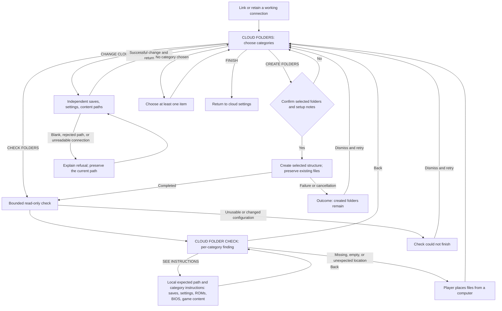
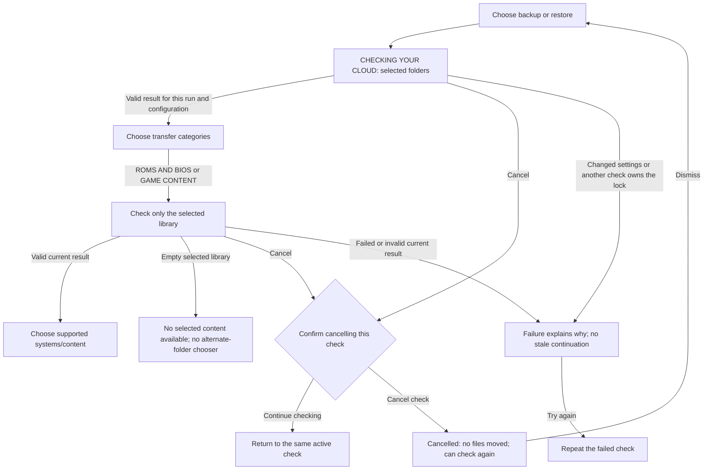

# Cloud folder flow review

Status: validator source and VM proof in progress, 2026-10-08 (D-CLOUD-178).
#510 owns this contract. Distribution `6f89bc7cec` and ES `baeea2a8c9`
implement category checks, explicit creation, independent paths and local
instructions. The main source-overlay UI paths and broader regressions pass;
additional help/error variants found by the independent coverage review are
being proved before UI completion. Firmware qualification remains separate;
integration and new device builds remain held. Generic smaller-file repair
is still an open contract item below. #511 is a separate parallel site
planning track, with GitHub Pages as the initial hosting candidate; publishing the guides is not a firmware RC prerequisite.

## Who is upgrading

The maintainer confirms that nobody else used the fork or the changes in the
unmerged ROCKNIX PRs. Product adoption is from publicly released ROCKNIX, plus
a clean install. The maintainer's experimental `/ROCKNIX` to `/pixelelated`
cloud move is a separate recovery task, not a compatibility requirement for
the product. Existing experimental-state receipts remain historical evidence.

The official latest release checked on 2026-10-07 is
[ROCKNIX 20261001](https://github.com/ROCKNIX/distribution/releases/tag/20261001),
tag commit `c445081a59518f37d9776e5412dd7b14910696f7`.
Its [cloud configuration](https://github.com/ROCKNIX/distribution/blob/20261001/projects/ROCKNIX/packages/network/rclone/sources/cloud_sync.conf)
uses `SYNCPATH=/GAMES` and `SYNCPATH_BACKUP=/GAMES/backup`. The default
[allowlist](https://github.com/ROCKNIX/distribution/blob/20261001/projects/ROCKNIX/packages/network/rclone/sources/cloud_sync-rules.txt)
includes progress, screenshots and backup archives, and excludes ordinary
ROM/BIOS content. This release does not install the fork's cloud setup, content
transfer or layout-migration helpers. Custom user configurations still exist.

This is an adoption baseline, not a request to merge newer upstream product
code across the existing source freeze. Retain the ordinary config-key
conversion and safety checks needed by that real predecessor; review inferred
content defaults and unpublished-layout fallbacks against this actual scope.

## What the old tidier actually did

Submitted distribution PR3404 at `4c83ebede40af27a375ced4cac72983be5715944`
and ES PR40 at `ca300dd41e13c168023e9e3d8aa7afb874170455` already exposed
the optional tidier before the hard fork. Neither PR merged.

The engine copied, verified and deleted files, rather than merely changing
folder settings. It processed settings backups, saves and, for derived old
content paths, ROMs/BIOS. A recovery branch also treated a `/Content` suffix
as evidence of an old layout. Its saves move recursively listed that folder
with exclusions for other tiers; it did not apply the ordinary progress
allowlist. Removing the content-tier move alone would therefore not establish
a progress-only operation. On providers without usable hashes, verification
could download source and destination bytes through the handheld.

The manual-setup draft removed that engine and its UI action but retained a
`cloud_backup` warning directing nested-folder users to the removed TIDY
action. Public ROCKNIX's nested backup default could trigger it. Commit
`2cffff3f38` replaces that instruction with the independent folder settings;
final firmware inclusion is still pending.

## Historical draft capabilities and gaps

This table describes the pre-validator drafts `3268015c` and `300f97d2`,
which motivated the changes below. It is not the current implementation.

| Control | What those historical drafts did | Design consequence |
| --- | --- | --- |
| Link cloud storage | Uses configured paths; creates directories and README files. | Linking must remain separate from relocating files. |
| Change Cloud Folder | Changes the saves pointer and derives sibling Backups and Content pointers. No files move. | It can overwrite an independently chosen library location. Its name does not explain that scope. |
| ROM/content chooser | Changes only CONTENT_REMOTE; preserves saves and settings paths. | Useful existing mechanism, but it is not yet a clear standalone library setting. |
| Chooser navigation | Offers a discovered candidate, provider root and root-level children, when restore finds no content at the selected location. | No recursive browser or arbitrary nested-path entry in this UI. The backend setter accepts a validated nested path. |
| Content backup | Writes ROMs under `<content>/ROMs/<system>` and BIOS under `<content>/BIOS`. | Selecting a folder does not currently select an arbitrary library layout. |
| Content restore | Reads the tiered shape, a flat selected-root shape, and certain provider-root fallbacks. | The selected root is not an exclusive boundary; backup/restore can use different shapes. |
| System selection | Selects system names for deliberate content transfers. | It does not define per-system remote paths or require the whole cloud library locally. |

Source: `cloud_setup` setters and `--content-location`,
`cloud_content_backup::remote_for`, `cloud_content_restore::resolve_src`,
`cloud_sync_helper` config conversion, and ES `cloudOfferContentFolder`,
`cloudOpenContentFolderChooser` and `cloudSetupOpenSyncPathEditor` in the
local #508 worktrees. The source proof and actual UI receipts are retained
under `docs/qa-logs/2026-10-07-manual-cloud-setup/`; they describe this draft,
not an approved future flow or an assembled firmware image.

## Agreed direction: check categories, then offer explicit actions

1. Link cloud storage, or retain the working connection and selected paths
   from public ROCKNIX. Linking does not authorize a move or a restore.
2. Create the supported structure for enabled features after the setup action.
   Fresh defaults remain `/pixelelated/Saves`, `/pixelelated/Backups` and
   `/pixelelated/Content`. ROMs use `<content>/ROMs/<system>` and BIOS uses
   `<content>/BIOS`. Existing pointers remain until deliberately changed;
   changing a progress location must not silently replace a separate library
   choice. A general arbitrary-layout browser is outside this first contract.
3. Let the player place ROMs and BIOS into the expected structure from a
   computer. A device need not have every system or game in the cloud library.
4. Offer read-only checks for enabled categories, using the existing scan and
   category interface where their behavior fits. A completed check reports
   findings; it does not organize, download, overwrite or remove cloud files.
5. For recognized progress-file problems, offer a separate bounded action
   only after its exact plan is shown. ROM and BIOS findings offer instructions
   and expected paths. Normal selective backup/restore remains a separate
   deliberate action.

The implemented diagram and screenshot coverage are below. The prospective
progress-file repair is described under **Small-file fixes**; it is not an
implemented branch or a qualified screen.

## Implemented flow and visual proof

This is the #508/#510 source draft, not the accepted firmware. Category
switches select the scope of the next check/create action; they do not enable
automatic sync or change its separate settings. Saves/settings start selected;
ROMs, BIOS and game content start unselected. Linking alone moves no files
and creates no folders.

The changed backup/restore preview keeps its own read-only check and transfer
choice. It does not discover or adopt another library when the selected one
is empty:

**Coverage record (D-WORKFLOW-155/156).** The disposable-VM source-overlay
checkpoint contains 41 screenshots: 39 reviewed and two rejected. Its77
index entries include36 explicitly pending states (35 supplemental states
and final-firmware CF10). EN/FR at 640×480 and 1280×800 are represented. The
[evidence index](../qa-logs/2026-10-07-cloud-validator/ui/evidence-index.json) records exact source, installed
hashes, trigger/outcome and review for each frame; the [root review](../qa-logs/2026-10-07-cloud-validator/ui/root-review.json)
checks the original42 entries’ references, dimensions, digests and branch
status. The later [independent inventory](../qa-logs/2026-10-07-cloud-validator/reference-review02.md)
identifies supplemental states; they are not covered by that initial review. Earlier frames
retain their source plus explicit unchanged-input justification. Failed
cancellation and truncated-JSON frames remain rejected evidence. This packet
does not replace the historical firmware benchmark or qualify a new image.
Independent review found missing variants despite these passing frames:
saves/settings/game-content instructions, rejected or unreadable path editing,
the changed nested-folder backup warning's actual display behavior, invalid
check responses, and the changed scan/selected-library continuation. These
are explicitly pending supplemental proof; CF01–CF09 are not blanket coverage
of every category-specific string. Existing passing frames remain valid.

| Flow/branch | Trigger and expected outcome | Reviewed evidence and remaining gate |
| --- | --- | --- |
| CF01 — connected setup | Enter from the cloud hub or complete a connection; category choices appear without creating or relocating files, including OAuth CONTINUE. | [Connected categories](../qa-logs/2026-10-07-cloud-validator/ui/frames/en640-link-complete/01-folder-scope.png); provider inventory unchanged. **Pending:** new hub row/return and OAuth CONTINUE callback proof or explicit supported evidence reuse. |
| CF02 — check selected folders | Choose categories; read-only results show only those paths and distinguish files found, missing, empty, unexpected location and unreadable. | 30 host controls; [populated results](../qa-logs/2026-10-07-cloud-validator/ui/frames/fr640-sealed-results/02-populated-findings.png) and [misplaced ROMs](../qa-logs/2026-10-07-cloud-validator/ui/frames/fr640-sealed-help/01-misplaced-roms.png). All category states are indexed. |
| CF03 — create selected folders | Confirm; only chosen folders/notes are created; completion starts a fresh check. Decline changes nothing. | [Confirmation](../qa-logs/2026-10-07-cloud-validator/ui/frames/en640-create-saves/01-create-confirmation.png), [completion](../qa-logs/2026-10-07-cloud-validator/ui/frames/en640-create-saves/02-creation-result.png), and [decline](../qa-logs/2026-10-07-cloud-validator/ui/frames/en640-final-create-decline/02-declined.png); inventory receipts retained. **Pending:** existing CloudOffer saves-only callback proof or explicit unchanged-surface reuse with final selective-seeding controls. |
| CF04 — manual instructions | Open help from a finding; expected path and category guidance appear; Back returns without changing configuration or files. | [ROM instructions](../qa-logs/2026-10-07-cloud-validator/ui/frames/fr640-sealed-help/02-rom-instructions.png) and [BIOS instructions](../qa-logs/2026-10-07-cloud-validator/ui/frames/fr1280-sealed-help/04-bios-instructions.png); EN/FR at both sizes indexed. QR awaits guide publication. **Pending:** saves/settings/game-content help variants. |
| CF05 — change a path | Edit one pointer; others survive; return shows the new paths and retains the category choices. | [Changed path](../qa-logs/2026-10-07-cloud-validator/ui/frames/en640-path-return/01-changed-settings.png) and [returned selection](../qa-logs/2026-10-07-cloud-validator/ui/frames/en640-path-return/02-returned-selection.png), with independent-pointer receipts. **Pending:** blank-path and rejected/unreadable path-change screens. |
| CF06 — stale configuration | Change the config/endpoint between display/check/confirmation and use; reject stale results/actions and require a refreshed view. | Bound-context controls and [stale-action refusal](../qa-logs/2026-10-07-cloud-validator/ui/frames/en640-stale-rejection/01-stale-rejected.png). |
| CF07 — cannot read/retry | Synthetic endpoint refuses or returns partial output; no false empty/success; retry uses the current config. | Failure/partial-output controls and [unreadable result](../qa-logs/2026-10-07-cloud-validator/ui/frames/en640-unreadable-result/01-unreadable-result.png); paused endpoint restored for subsequent successful retry. |
| CF08 — no selection | Turn off every category; Check/Create asks for at least one item without contacting the cloud. | [Create refusal](../qa-logs/2026-10-07-cloud-validator/ui/frames/en640-no-selection/02-create-needs-selection.png) and [check refusal](../qa-logs/2026-10-07-cloud-validator/ui/frames/en640-no-selection/03-check-needs-selection.png); French equivalents indexed. |
| CF09 — creation interrupted | Cancel/fail during creation; outcome explains retained folders and permits retry without moving user files. | [Corrected cancellation](../qa-logs/2026-10-07-cloud-validator/ui/frames/en640-final-cancelled/01-cancelled-outcome.png) and [retry](../qa-logs/2026-10-07-cloud-validator/ui/frames/en640-final-retry/01-retry-result.png). Cancellation completes while endpoint stays paused, with no child and unchanged inventory. Earlier delayed cancellation is rejected. **Pending:** non-cancel creation failure and retry; #512 translates the three newly surfaced failure reasons. |
| CF10 — clean/public adoption | Fresh defaults and public ROCKNIX /GAMES plus /GAMES/backup remain distinct cases; preserve existing pointers/credentials/data. | Three public-config host controls pass. **Pending:** assembled firmware clean/public adoption; source overlays cannot close it. |
| CF11 — nested-folder backup outcome | Back up with a settings/content path inside the saves path; review the actual transfer outcome and trace the script diagnostic separately. | **Pending:** focused screenshots and consumer-trace receipt. The plain stdout warning is discarded by the ES transfer parser; no visible warning is claimed. |
| CF12 — invalid folder-check response | Valid context but the check cannot supply a usable result; show the generic check-failed dialog, preserve selection, and allow another check. | **Pending:** actual helper execution fault, restored permissions/hash, and reviewed dialog. This is distinct from a valid unreadable-category finding. |
| CF13 — scan interruption or failure | Cancel a scan, or change its config/encounter its lock; explain the actual outcome without claiming files moved or advancing with stale data. | **Pending:** scan-specific cancellation confirmation/outcome, changed-settings and check-busy diagnostic surfaces, and successful retry. Creation cancellation is different copy. |
| CF14 — selected-library restore | Continue through scan, categories and supported systems using only the configured content root; an empty root must not discover a populated unselected library. | **Pending:** actual final-source navigation and scoped empty/populated controls. The historical removed-chooser screenshots cannot establish this behavior. |
| CF15 — restore relink finish | Finish relinking after settings restore; return to the caller without scheduling a folder migration. | **Pending:** narrow synthetic callback proof or explicit unchanged-surface/removal evidence reuse. No real OAuth or personal cloud is required. |

Source controls are retained under
[`2026-10-07-cloud-validator`](../qa-logs/2026-10-07-cloud-validator/).
Menu placement is in [the canonical map](../es-menu-map.md#cloud-our-subtree).
Folder findings establish presence within bounded metadata, not transfer
integrity or BIOS compatibility. Backup/restore remains a separate action.

## Findings and boundaries

| Category | What a lightweight check can establish | Action |
| --- | --- | --- |
| Saves: game saves, save states and screenshots | Selected folder is readable; recognized progress paths are in the supported layout. | A separately previewed fix for a recognized case, or local instructions. No containing-directory move. |
| Settings backups | Selected folder is readable and archive names/locations are recognized. | Existing explicit backup/restore or an explanation. Availability is not archive integrity; archives are not silently included in a progress fix. |
| ROMs and BIOS | Expected folders and recognized systems/content are present within the selected scope. | Expected paths and manual instructions; separate ROM and BIOS guide targets when published. No library relocation. |
| Game content | Selected artwork, manuals and other supported classes occupy recognized locations. | Explain findings; transfer only through the existing explicit content action. |

Results distinguish **missing**, **empty**, **present**, **misplaced** and
**unreadable**. A network, permission or failed partial-listing result is not
absence. Misplaced means recognized evidence was found inside the explicitly
inspected scope; it does not mean an account-wide search ran. Missing at the
expected path does not prove the files are nowhere in the account.

Keep initial checks bounded: no recursive whole-account census or bulk ROM
readback. Record the checked categories, exact selected roots and run/config
identity so a cached success cannot describe another configuration. Folder
readiness does not establish every byte was copied, every original file is
present, or BIOS files are compatible. Full integrity needs separate evidence;
never silently download a large library to strengthen the result.

## Reuse rather than a second framework

Historical source inventory: distribution draft `3268015c185b04a17e756829ee116c664d679b4e`
and ES draft `300f97d28a072b916c54dcbf108f1440e7253761`.
This table records the seams and gaps found before implementation. Its old
coupled setters, all-category seeding and unbound cache stamps have now been
replaced in the local source identified above; their final proof is tracked
in the flow table, not inferred from this inventory.

| Existing code | Reuse | Boundary to address |
| --- | --- | --- |
| `cloud_setup` folder readers | Selected-path parsing, successful scoped listings and category presence. | Current `--folder-state` checks saves only; ancestor fallback changes relative namespace spelling. Strict checks must preserve relative/absolute semantics. |
| `cloud_setup --seed-folders` | Folder and README creation as an explicit setup action. | It currently seeds every tier; introduce enabled-category scope separately from validation. |
| Content mapping/classifiers and `--known-directories` | Existing system names and ROM/BIOS layout rules. | Known local directories are not proof of device support. Do not invoke recursive `--scan`, account-root discovery or alternate-location fallbacks as strict validation. |
| Settings archive reader | Name/location availability with supplied identity. | Do not generate/heal device identity or download archive payloads during folder checks. |
| `rocknix-systems` BIOS checks | Existing local, core-aware presence/hash checks after content is present. | Local compatibility is separate from cloud folder readiness. |
| ES scan job and category surfaces | Job ownership, progress, completion and existing category vocabulary. | Shared-job identity and config-bound results are required; current existence-only cache stamps are insufficient. Scan cancellation must not say a backup/restore has copied files. |
| ES QR row and untinted image helper | Black/white QR presentation. | Use a guidance modal with usable controller dismissal and wrapping; fixed transfer-result lines cannot hold full paths and QR. Do not invoke OAuth/session/browser helpers. |

The current ROM system picker persists choices even on Back, so it is not a
read-only findings page. Existing save backup/restore also take locks, merge
configuration, transfer files and update retained state. They cannot serve as
validators or category repair shortcuts.

## Small-file fixes

The owner permits fixes for smaller file types. No category-scoped cloud repair
API exists yet. Define concrete supported cases and an exact plan before
implementation: source/destination, selected classes, file count/bytes,
collisions, stale-plan refusal, interruption and verification costs. A
screenshot can be large; the category alone is not a size bound.

Use the ordinary progress allowlist, including standalone emulator paths.
Exclude ROMs, BIOS, game content, settings archives and unknown files. Preserve
conflicting versions; never default to the newest as the winner. The removed
migration engine's copy/check/delete and pointer rewrites are not a repair API.
The plan must state whether source files remain and what happens on failure.
A check or opening instructions authorizes none of these changes.

### First implementation boundary

The current implementation provides **Create folders** for explicitly selected
categories. It creates missing structure and setup notes while preserving
existing files. It does not repair progress-file placement. Recognized or
uncertain misplaced files get instructions and their expected paths.

No existing public ROCKNIX behavior establishes a safe generic relocation
mapping: its progress allowlist deliberately accepts standalone emulator
layouts and save extensions outside `savefiles`. Moving every such file into
that folder would break supported saves. A repeated-folder name alone is not
proof either. Therefore this implementation exposes no blanket **Fix** action.
The smaller-file repair requirement remains open until a concrete recognized
case has source evidence and the bounded preview/collision/verification
contract above is proved. No repair API or completed repair proof is claimed.

## Instructions now, QR guides when the site is live

#511/D-WORKFLOW-152/153 starts a parallel path to a dedicated site repository
and a static first site, with GitHub Pages as the initial hosting candidate.
Hosting remains open to actual future service needs. The confirmed domain is
`pixelelated.com` (D-WORKFLOW-154); the private website repository and starter
are ready. Recheck live DNS before preparing web records. It includes a wiki with cloud setup and
separate ROM and BIOS guides. Existing #345 covers the earlier placeholder;
#323 supplies documentation voice and source material. No site deployment or
framework change is implied by this review document.

Use **See instructions** for ROM/BIOS findings, not a Fix label. The current
interface can show the expected path and instructions locally. After the
matching page is published and checked, the action opens a modal with its
QR code, a short explanation and a readable address. ROM findings go to the
ROM guide; BIOS findings go to the BIOS guide. Do not expect a clickable link
or browser on the handheld, encode personal paths or credentials, or ship a
speculative destination. Local guidance remains useful offline.

Prove actual QR decoding and controller navigation on the VM, including
English/French at 640×480 and the larger dialog layout. The pre-validator draft
had a clipped English introduction at 1280×800. The replacement has reviewed
EN/FR 640×480 and 1280×800 fit proof in the current packet. Actual QR decoding
and its new navigation remain future proof after the guides are published.

## Remaining implementation work

The local drafts implement category checks, independent pointers, explicit
category seeding, selected-root-only discovery, updated TIDY guidance and
scan/result/help UI. Focused controls, the full host suite and ordinary VM
WebDAV/SFTP round trips pass. Finish the specifically named help/error/warning
visual gaps above; preserve the existing passing main-flow frames. Clean and
actual public ROCKNIX firmware adoption and final input/inclusion mapping
remain separate gates. The
small-file repair scope question remains pending; do not call it delivered.
#507 independently audits the frozen resulting delta. New device firmware
and physical smoke follow that sequence.

The maintainer's Dropbox cleanup is separate: private inventory, then an exact
reconciliation plan under its own authorization. Do not infer a whole-folder
rename when both namespaces contain files, discard differing saves, or add a
product compatibility branch solely for that experimental state.
