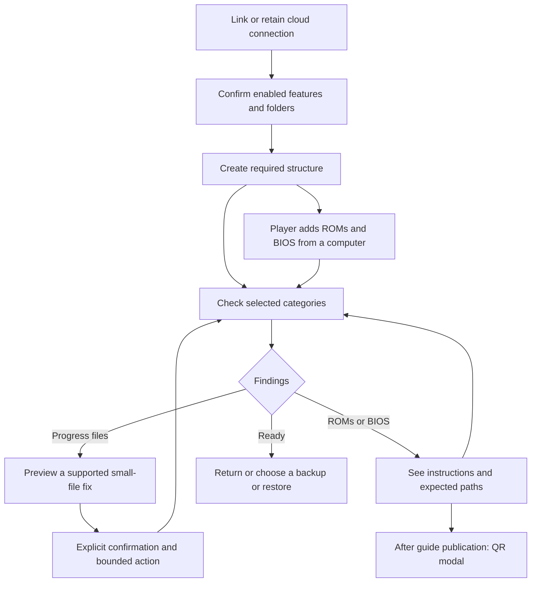

# Cloud folder flow review

Status: validator direction agreed, 2026-10-07 (D-CLOUD-178). #510 owns
this contract; #508's retained local drafts need reconciliation and further
qualification before integration or a new device build. The existing proofs
qualify those draft bytes only. #511 is a separate parallel site
planning track, with GitHub Pages as the initial hosting candidate; publishing the guides is not a firmware RC prerequisite.

## Who is upgrading

The maintainer confirms that nobody else used the fork or the changes in the
unmerged ROCKNIX PRs. Product adoption is from publicly released ROCKNIX, plus
a clean install. The maintainer's experimental `/ROCKNIX` to `/pixelelated`
cloud move is a separate recovery task, not a compatibility requirement for
the product. Existing experimental-state receipts remain historical evidence.

The official latest release checked on 2026-10-07 is
[ROCKNIX 20261001](https://github.com/ROCKNIX/distribution/releases/tag/20261001),
tag commit `c445081a59518f37d9776e5412dd7b14910696f7`.
Its [cloud configuration](https://github.com/ROCKNIX/distribution/blob/20261001/projects/ROCKNIX/packages/network/rclone/sources/cloud_sync.conf)
uses `SYNCPATH=/GAMES` and `SYNCPATH_BACKUP=/GAMES/backup`. The default
[allowlist](https://github.com/ROCKNIX/distribution/blob/20261001/projects/ROCKNIX/packages/network/rclone/sources/cloud_sync-rules.txt)
includes progress, screenshots and backup archives, and excludes ordinary
ROM/BIOS content. This release does not install the fork's cloud setup, content
transfer or layout-migration helpers. Custom user configurations still exist.

This is an adoption baseline, not a request to merge newer upstream product
code across the existing source freeze. Retain the ordinary config-key
conversion and safety checks needed by that real predecessor; review inferred
content defaults and unpublished-layout fallbacks against this actual scope.

## What the old tidier actually did

Submitted distribution PR3404 at `4c83ebede40af27a375ced4cac72983be5715944`
and ES PR40 at `ca300dd41e13c168023e9e3d8aa7afb874170455` already exposed
the optional tidier before the hard fork. Neither PR merged.

The engine copied, verified and deleted files, rather than merely changing
folder settings. It processed settings backups, saves and, for derived old
content paths, ROMs/BIOS. A recovery branch also treated a `/Content` suffix
as evidence of an old layout. Its saves move recursively listed that folder
with exclusions for other tiers; it did not apply the ordinary progress
allowlist. Removing the content-tier move alone would therefore not establish
a progress-only operation. On providers without usable hashes, verification
could download source and destination bytes through the handheld.

The new draft removes that engine and its UI action. One player-facing
`cloud_backup` warning still directs users with nested folders to the removed
TIDY action. Public ROCKNIX's nested backup default can trigger that warning;
its replacement must match the agreed flow before this draft ships.

## Present capabilities and gaps

| Control | What the current code does | Design consequence |
| --- | --- | --- |
| Link cloud storage | Uses configured paths; creates directories and README files. | Linking must remain separate from relocating files. |
| Change Cloud Folder | Changes the saves pointer and derives sibling Backups and Content pointers. No files move. | It can overwrite an independently chosen library location. Its name does not explain that scope. |
| ROM/content chooser | Changes only CONTENT_REMOTE; preserves saves and settings paths. | Useful existing mechanism, but it is not yet a clear standalone library setting. |
| Chooser navigation | Offers a discovered candidate, provider root and root-level children, when restore finds no content at the selected location. | No recursive browser or arbitrary nested-path entry in this UI. The backend setter accepts a validated nested path. |
| Content backup | Writes ROMs under `<content>/ROMs/<system>` and BIOS under `<content>/BIOS`. | Selecting a folder does not currently select an arbitrary library layout. |
| Content restore | Reads the tiered shape, a flat selected-root shape, and certain provider-root fallbacks. | The selected root is not an exclusive boundary; backup/restore can use different shapes. |
| System selection | Selects system names for deliberate content transfers. | It does not define per-system remote paths or require the whole cloud library locally. |

Source: `cloud_setup` setters and `--content-location`,
`cloud_content_backup::remote_for`, `cloud_content_restore::resolve_src`,
`cloud_sync_helper` config conversion, and ES `cloudOfferContentFolder`,
`cloudOpenContentFolderChooser` and `cloudSetupOpenSyncPathEditor` in the
local #508 worktrees. The source proof and actual UI receipts are retained
under `docs/qa-logs/2026-10-07-manual-cloud-setup/`; they describe this draft,
not an approved future flow or an assembled firmware image.

## Agreed direction: check categories, then offer explicit actions

1. Link cloud storage, or retain the working connection and selected paths
   from public ROCKNIX. Linking does not authorize a move or a restore.
2. Create the supported structure for enabled features after the setup action.
   Fresh defaults remain `/pixelelated/Saves`, `/pixelelated/Backups` and
   `/pixelelated/Content`. ROMs use `<content>/ROMs/<system>` and BIOS uses
   `<content>/BIOS`. Existing pointers remain until deliberately changed;
   changing a progress location must not silently replace a separate library
   choice. A general arbitrary-layout browser is outside this first contract.
3. Let the player place ROMs and BIOS into the expected structure from a
   computer. A device need not have every system or game in the cloud library.
4. Offer read-only checks for enabled categories, using the existing scan and
   category interface where their behavior fits. A completed check reports
   findings; it does not organize, download, overwrite or remove cloud files.
5. For recognized progress-file problems, offer a separate bounded action
   only after its exact plan is shown. ROM and BIOS findings offer instructions
   and expected paths. Normal selective backup/restore remains a separate
   deliberate action.

## Findings and boundaries

| Category | What a lightweight check can establish | Action |
| --- | --- | --- |
| Saves: game saves, save states and screenshots | Selected folder is readable; recognized progress paths are in the supported layout. | A separately previewed fix for a recognized case, or local instructions. No containing-directory move. |
| Settings backups | Selected folder is readable and archive names/locations are recognized. | Existing explicit backup/restore or an explanation. Availability is not archive integrity; archives are not silently included in a progress fix. |
| ROMs and BIOS | Expected folders and recognized systems/content are present within the selected scope. | Expected paths and manual instructions; separate ROM and BIOS guide targets when published. No library relocation. |
| Game content | Selected artwork, manuals and other supported classes occupy recognized locations. | Explain findings; transfer only through the existing explicit content action. |

Results distinguish **missing**, **empty**, **present**, **misplaced** and
**unreadable**. A network, permission or failed partial-listing result is not
absence. Misplaced means recognized evidence was found inside the explicitly
inspected scope; it does not mean an account-wide search ran. Missing at the
expected path does not prove the files are nowhere in the account.

Keep initial checks bounded: no recursive whole-account census or bulk ROM
readback. Record the checked categories, exact selected roots and run/config
identity so a cached success cannot describe another configuration. Folder
readiness does not establish every byte was copied, every original file is
present, or BIOS files are compatible. Full integrity needs separate evidence;
never silently download a large library to strengthen the result.

## Reuse rather than a second framework

Source inventory: distribution draft `3268015c185b04a17e756829ee116c664d679b4e`
and ES draft `300f97d28a072b916c54dcbf108f1440e7253761`.

| Existing code | Reuse | Boundary to address |
| --- | --- | --- |
| `cloud_setup` folder readers | Selected-path parsing, successful scoped listings and category presence. | Current `--folder-state` checks saves only; ancestor fallback changes relative namespace spelling. Strict checks must preserve relative/absolute semantics. |
| `cloud_setup --seed-folders` | Folder and README creation as an explicit setup action. | It currently seeds every tier; introduce enabled-category scope separately from validation. |
| Content mapping/classifiers and `--known-directories` | Existing system names and ROM/BIOS layout rules. | Known local directories are not proof of device support. Do not invoke recursive `--scan`, account-root discovery or alternate-location fallbacks as strict validation. |
| Settings archive reader | Name/location availability with supplied identity. | Do not generate/heal device identity or download archive payloads during folder checks. |
| `rocknix-systems` BIOS checks | Existing local, core-aware presence/hash checks after content is present. | Local compatibility is separate from cloud folder readiness. |
| ES scan job and category surfaces | Job ownership, progress, completion and existing category vocabulary. | Shared-job identity and config-bound results are required; current existence-only cache stamps are insufficient. Scan cancellation must not say a backup/restore has copied files. |
| ES QR row and untinted image helper | Black/white QR presentation. | Use a guidance modal with usable controller dismissal and wrapping; fixed transfer-result lines cannot hold full paths and QR. Do not invoke OAuth/session/browser helpers. |

The current ROM system picker persists choices even on Back, so it is not a
read-only findings page. Existing save backup/restore also take locks, merge
configuration, transfer files and update retained state. They cannot serve as
validators or category repair shortcuts.

## Small-file fixes

The owner permits fixes for smaller file types. No category-scoped cloud repair
API exists yet. Define concrete supported cases and an exact plan before
implementation: source/destination, selected classes, file count/bytes,
collisions, stale-plan refusal, interruption and verification costs. A
screenshot can be large; the category alone is not a size bound.

Use the ordinary progress allowlist, including standalone emulator paths.
Exclude ROMs, BIOS, game content, settings archives and unknown files. Preserve
conflicting versions; never default to the newest as the winner. The removed
migration engine's copy/check/delete and pointer rewrites are not a repair API.
The plan must state whether source files remain and what happens on failure.
A check or opening instructions authorizes none of these changes.

## Instructions now, QR guides when the site is live

#511/D-WORKFLOW-152/153 starts a parallel path to a dedicated site repository
and a static first site, with GitHub Pages as the initial hosting candidate.
Hosting remains open to actual future service needs. Confirm the domain spelling
before DNS changes; the previously recorded domain is `pixelelated.com`. It includes a wiki with cloud setup and
separate ROM and BIOS guides. Existing #345 covers the earlier placeholder;
#323 supplies documentation voice and source material. No site deployment or
framework change is implied by this review document.

Use **See instructions** for ROM/BIOS findings, not a Fix label. The current
interface can show the expected path and instructions locally. After the
matching page is published and checked, the action opens a modal with its
QR code, a short explanation and a readable address. ROM findings go to the
ROM guide; BIOS findings go to the BIOS guide. Do not expect a clickable link
or browser on the handheld, encode personal paths or credentials, or ship a
speculative destination. Local guidance remains useful offline.

Prove actual QR decoding and controller navigation on the VM, including
English/French at 640×480 and the larger dialog layout. The retained draft
still has a clipped English introduction at 1280×800; it is an open UI defect,
not complete visual acceptance.

## Remaining implementation work

The direction is chosen. #508 must now reconcile category checks, independent
pointer preservation, enabled-feature seeding, selected-root-only discovery,
small-file repair plans, the obsolete TIDY warning and scan/result/help UI.
Then run focused synthetic source/VM checks, including clean and actual public
ROCKNIX adoption, before integration. #507 independently audits the frozen
resulting delta. Firmware inclusion and physical smoke follow that sequence.

The maintainer's Dropbox cleanup is separate: private inventory, then an exact
reconciliation plan under its own authorization. Do not infer a whole-folder
rename when both namespaces contain files, discard differing saves, or add a
product compatibility branch solely for that experimental state.
